```mermaid
flowchart TB
    subgraph current["AspNetCoreMvc.csproj"]
        MAIN["<b>📦&nbsp;AspNetCoreMvc.csproj</b><br/><small>net6.0</small>"]
        click MAIN "#aspnetcoremvcaspnetcoremvccsproj"
    end
    subgraph downstream["Dependencies (1"]
        P2["<b>📦&nbsp;Data.csproj</b><br/><small>netstandard2.0</small>"]
        click P2 "#datadatacsproj"
    end
    MAIN --> P2

```

```mermaid
flowchart TB
    subgraph current["AspNetWebForms.csproj"]
        MAIN["<b>⚙️&nbsp;AspNetWebForms.csproj</b><br/><small>net48</small>"]
        click MAIN "#aspnetwebformsaspnetwebformscsproj"
    end
    subgraph downstream["Dependencies (1"]
        P2["<b>📦&nbsp;Data.csproj</b><br/><small>netstandard2.0</small>"]
        click P2 "#datadatacsproj"
    end
    MAIN --> P2

```

```mermaid
flowchart TB
    subgraph upstream["Dependants (2)"]
        P1["<b>⚙️&nbsp;AspNetWebForms.csproj</b><br/><small>net48</small>"]
        P3["<b>📦&nbsp;AspNetCoreMvc.csproj</b><br/><small>net6.0</small>"]
        click P1 "#aspnetwebformsaspnetwebformscsproj"
        click P3 "#aspnetcoremvcaspnetcoremvccsproj"
    end
    subgraph current["Data.csproj"]
        MAIN["<b>📦&nbsp;Data.csproj</b><br/><small>netstandard2.0</small>"]
        click MAIN "#datadatacsproj"
    end
    P1 --> MAIN
    P3 --> MAIN

```

# Projects and dependencies analysis

This document provides a comprehensive overview of the projects and their dependencies in the context of upgrading to .NETCoreApp,Version=v10.0.

## Table of Contents

- [Executive Summary](#executive-Summary)
  - [Highlevel Metrics](#highlevel-metrics)
  - [Projects Compatibility](#projects-compatibility)
  - [Package Compatibility](#package-compatibility)
  - [API Compatibility](#api-compatibility)
- [Aggregate NuGet packages details](#aggregate-nuget-packages-details)
- [Top API Migration Challenges](#top-api-migration-challenges)
  - [Technologies and Features](#technologies-and-features)
  - [Most Frequent API Issues](#most-frequent-api-issues)
- [Projects Relationship Graph](#projects-relationship-graph)
- [Project Details](#project-details)

  - [AspNetCoreMvc\AspNetCoreMvc.csproj](#aspnetcoremvcaspnetcoremvccsproj)
  - [AspNetWebForms\AspNetWebForms.csproj](#aspnetwebformsaspnetwebformscsproj)
  - [Data\Data.csproj](#datadatacsproj)

## Executive Summary

### Highlevel Metrics

| Metric | Count | Status |
| :--- | :---: | :--- |
| Total Projects | 3 | 2 require upgrade |
| Total NuGet Packages | 27 | 8 need upgrade |
| Total Code Files | 41 |  |
| Total Code Files with Incidents | 15 |  |
| Total Lines of Code | 927 |  |
| Total Number of Issues | 103 |  |
| Estimated LOC to modify | 82+ | at least 8.8% of codebase |

### Projects Compatibility

| Project | Target Framework | Difficulty | Package Issues | API Issues | Est. LOC Impact | Description |
| :--- | :---: | :---: | :---: | :---: | :---: | :--- |
| [AspNetCoreMvc\AspNetCoreMvc.csproj](#aspnetcoremvcaspnetcoremvccsproj) | net6.0 | 🟢 Low | 2 | 0 |  | AspNetCore, Sdk Style = True |
| [AspNetWebForms\AspNetWebForms.csproj](#aspnetwebformsaspnetwebformscsproj) | net48 | 🔴 High | 12 | 82 | 82+ | Wap, Sdk Style = False |
| [Data\Data.csproj](#datadatacsproj) | netstandard2.0 | ✅ None | 0 | 0 |  | ClassLibrary, Sdk Style = True |

### Package Compatibility

| Status | Count | Percentage |
| :--- | :---: | :---: |
| ✅ Compatible | 19 | 70.4% |
| ⚠️ Incompatible | 7 | 25.9% |
| 🔄 Upgrade Recommended | 1 | 3.7% |
| ***Total NuGet Packages*** | ***27*** | ***100%*** |

### API Compatibility

| Category | Count | Impact |
| :--- | :---: | :--- |
| 🔴 Binary Incompatible | 69 | High - Require code changes |
| 🟡 Source Incompatible | 13 | Medium - Needs re-compilation and potential conflicting API error fixing |
| 🔵 Behavioral change | 0 | Low - Behavioral changes that may require testing at runtime |
| ✅ Compatible | 1945 |  |
| ***Total APIs Analyzed*** | ***2027*** |  |

## Aggregate NuGet packages details

| Package | Current Version | Suggested Version | Projects | Description |
| :--- | :---: | :---: | :--- | :--- |
| Antlr | 3.5.0.2 |  | [AspNetWebForms.csproj](#aspnetwebformsaspnetwebformscsproj) | Needs to be replaced with Replace with new package Antlr4=4.6.6 |
| Antlr3.Runtime | 3.5.1 |  | [AspNetWebForms.csproj](#aspnetwebformsaspnetwebformscsproj) | ✅Compatible |
| AspNet.ScriptManager.jQuery | 3.5.0 |  | [AspNetWebForms.csproj](#aspnetwebformsaspnetwebformscsproj) | ⚠️NuGet package is incompatible |
| bootstrap | 5.2.3 |  | [AspNetWebForms.csproj](#aspnetwebformsaspnetwebformscsproj) | ✅Compatible |
| FluentNHibernate | 3.2.0 |  | [AspNetCoreMvc.csproj](#aspnetcoremvcaspnetcoremvccsproj) [AspNetWebForms.csproj](#aspnetwebformsaspnetwebformscsproj) [Data.csproj](#datadatacsproj) | ✅Compatible |
| Iesi.Collections | 4.0.4 |  | [AspNetWebForms.csproj](#aspnetwebformsaspnetwebformscsproj) | ✅Compatible |
| jQuery | 3.5.0.1 |  | [AspNetWebForms.csproj](#aspnetwebformsaspnetwebformscsproj) | ✅Compatible |
| Microsoft.AspNet.FriendlyUrls | 1.0.2 |  | [AspNetWebForms.csproj](#aspnetwebformsaspnetwebformscsproj) | ⚠️NuGet package is incompatible |
| Microsoft.AspNet.FriendlyUrls.Core | 1.0.2 |  | [AspNetWebForms.csproj](#aspnetwebformsaspnetwebformscsproj) | ⚠️NuGet package is incompatible |
| Microsoft.AspNet.ScriptManager.MSAjax | 5.0.0 |  | [AspNetWebForms.csproj](#aspnetwebformsaspnetwebformscsproj) | ⚠️NuGet package is incompatible |
| Microsoft.AspNet.ScriptManager.WebForms | 5.0.0 |  | [AspNetWebForms.csproj](#aspnetwebformsaspnetwebformscsproj) | ⚠️NuGet package is incompatible |
| Microsoft.AspNet.Web.Optimization | 1.1.3 |  | [AspNetWebForms.csproj](#aspnetwebformsaspnetwebformscsproj) | ⚠️NuGet package is incompatible |
| Microsoft.AspNet.Web.Optimization.WebForms | 1.1.3 |  | [AspNetWebForms.csproj](#aspnetwebformsaspnetwebformscsproj) | ⚠️NuGet package is incompatible |
| Microsoft.AspNetCore.SystemWebAdapters.CoreServices | 1.1.0 |  | [AspNetCoreMvc.csproj](#aspnetcoremvcaspnetcoremvccsproj) | ✅Compatible |
| Microsoft.CodeDom.Providers.DotNetCompilerPlatform | 2.0.1 |  | [AspNetWebForms.csproj](#aspnetwebformsaspnetwebformscsproj) | NuGet package functionality is included with framework reference |
| Microsoft.Web.Infrastructure | 2.0.1 |  | [AspNetWebForms.csproj](#aspnetwebformsaspnetwebformscsproj) | NuGet package functionality is included with framework reference |
| Modernizr | 2.8.3 |  | [AspNetWebForms.csproj](#aspnetwebformsaspnetwebformscsproj) | ✅Compatible |
| NETStandard.Library | 2.0.3 |  | [Data.csproj](#datadatacsproj) | ✅Compatible |
| Newtonsoft.Json | 13.0.1 | 13.0.4 | [AspNetWebForms.csproj](#aspnetwebformsaspnetwebformscsproj) | NuGet package upgrade is recommended |
| NHibernate | 5.4.9 |  | [AspNetCoreMvc.csproj](#aspnetcoremvcaspnetcoremvccsproj) [AspNetWebForms.csproj](#aspnetwebformsaspnetwebformscsproj) [Data.csproj](#datadatacsproj) | ✅Compatible |
| Remotion.Linq | 2.2.0 |  | [AspNetWebForms.csproj](#aspnetwebformsaspnetwebformscsproj) | ✅Compatible |
| Remotion.Linq.EagerFetching | 2.2.0 |  | [AspNetWebForms.csproj](#aspnetwebformsaspnetwebformscsproj) | ✅Compatible |
| System.Data.SqlClient | 4.8.6 |  | [AspNetCoreMvc.csproj](#aspnetcoremvcaspnetcoremvccsproj) [AspNetWebForms.csproj](#aspnetwebformsaspnetwebformscsproj) [Data.csproj](#datadatacsproj) | ✅Compatible |
| System.Net.Http | 4.3.4 |  | [AspNetCoreMvc.csproj](#aspnetcoremvcaspnetcoremvccsproj) | NuGet package functionality is included with framework reference |
| System.Text.RegularExpressions | 4.3.1 |  | [AspNetCoreMvc.csproj](#aspnetcoremvcaspnetcoremvccsproj) | NuGet package functionality is included with framework reference |
| WebGrease | 1.6.0 |  | [AspNetWebForms.csproj](#aspnetwebformsaspnetwebformscsproj) | ✅Compatible |
| Yarp.ReverseProxy | 2.0.1 |  | [AspNetCoreMvc.csproj](#aspnetcoremvcaspnetcoremvccsproj) | ✅Compatible |

## Top API Migration Challenges

### Technologies and Features

| Technology | Issues | Percentage | Migration Path |
| :--- | :---: | :---: | :--- |
| ASP.NET Framework (System.Web) | 65 | 79.3% | Legacy ASP.NET Framework APIs for web applications (System.Web.*) that don't exist in ASP.NET Core due to architectural differences. ASP.NET Core represents a complete redesign of the web framework. Migrate to ASP.NET Core equivalents or consider System.Web.Adapters package for compatibility. |
| Legacy Configuration System | 6 | 7.3% | Legacy XML-based configuration system (app.config/web.config) that has been replaced by a more flexible configuration model in .NET Core. The old system was rigid and XML-based. Migrate to Microsoft.Extensions.Configuration with JSON/environment variables; use System.Configuration.ConfigurationManager NuGet package as interim bridge if needed. |

### Most Frequent API Issues

| API | Count | Percentage | Category |
| :--- | :---: | :---: | :--- |
| M:System.Web.UI.Page.#ctor | 4 | 4.9% | Binary Incompatible |
| T:System.Web.UI.Page | 4 | 4.9% | Binary Incompatible |
| T:System.Web.UI.WebControls.ContentPlaceHolder | 4 | 4.9% | Binary Incompatible |
| T:System.Web.Optimization.ScriptBundle | 3 | 3.7% | Binary Incompatible |
| M:System.Web.Optimization.ScriptBundle.#ctor(System.String) | 3 | 3.7% | Binary Incompatible |
| T:System.Web.Optimization.Bundle | 3 | 3.7% | Binary Incompatible |
| M:System.Web.Optimization.BundleCollection.Add(System.Web.Optimization.Bundle) | 3 | 3.7% | Binary Incompatible |
| T:System.Web.Routing.RouteCollection | 3 | 3.7% | Binary Incompatible |
| T:Microsoft.AspNet.FriendlyUrls.RedirectMode | 3 | 3.7% | Binary Incompatible |
| T:System.Web.UI.WebControls.Repeater | 3 | 3.7% | Binary Incompatible |
| T:System.Web.Optimization.BundleCollection | 2 | 2.4% | Binary Incompatible |
| M:System.Web.Optimization.Bundle.Include(System.String[]) | 2 | 2.4% | Binary Incompatible |
| M:System.Web.UI.MasterPage.#ctor | 2 | 2.4% | Binary Incompatible |
| T:System.Web.UI.MasterPage | 2 | 2.4% | Binary Incompatible |
| T:System.Web.Routing.RouteTable | 2 | 2.4% | Binary Incompatible |
| P:System.Web.Routing.RouteTable.Routes | 2 | 2.4% | Binary Incompatible |
| M:System.Web.Optimization.Bundle.Include(System.String,System.Web.Optimization.IItemTransform[]) | 1 | 1.2% | Binary Incompatible |
| T:Microsoft.AspNet.FriendlyUrls.RouteCollectionExtensions | 1 | 1.2% | Binary Incompatible |
| M:Microsoft.AspNet.FriendlyUrls.RouteCollectionExtensions.EnableFriendlyUrls(System.Web.Routing.RouteCollection,Microsoft.AspNet.FriendlyUrls.FriendlyUrlSettings) | 1 | 1.2% | Binary Incompatible |
| F:Microsoft.AspNet.FriendlyUrls.RedirectMode.Permanent | 1 | 1.2% | Binary Incompatible |
| P:Microsoft.AspNet.FriendlyUrls.FriendlyUrlSettings.AutoRedirectMode | 1 | 1.2% | Binary Incompatible |
| T:Microsoft.AspNet.FriendlyUrls.FriendlyUrlSettings | 1 | 1.2% | Binary Incompatible |
| M:Microsoft.AspNet.FriendlyUrls.FriendlyUrlSettings.#ctor | 1 | 1.2% | Binary Incompatible |
| M:System.Web.UI.Control.DataBind | 1 | 1.2% | Binary Incompatible |
| M:System.Web.UI.WebControls.Repeater.DataBind | 1 | 1.2% | Binary Incompatible |
| P:System.Web.UI.WebControls.Repeater.DataSource | 1 | 1.2% | Binary Incompatible |
| P:System.Web.UI.Page.IsPostBack | 1 | 1.2% | Binary Incompatible |
| T:System.Configuration.ConfigurationManager | 1 | 1.2% | Source Incompatible |
| T:System.Configuration.ConnectionStringSettingsCollection | 1 | 1.2% | Source Incompatible |
| P:System.Configuration.ConfigurationManager.ConnectionStrings | 1 | 1.2% | Source Incompatible |
| T:System.Configuration.ConnectionStringSettings | 1 | 1.2% | Source Incompatible |
| P:System.Configuration.ConnectionStringSettingsCollection.Item(System.String) | 1 | 1.2% | Source Incompatible |
| P:System.Configuration.ConnectionStringSettings.ConnectionString | 1 | 1.2% | Source Incompatible |
| T:System.Web.Optimization.BundleTable | 1 | 1.2% | Binary Incompatible |
| P:System.Web.Optimization.BundleTable.Bundles | 1 | 1.2% | Binary Incompatible |
| M:System.Web.HttpApplication.#ctor | 1 | 1.2% | Source Incompatible |
| T:System.Web.HttpApplication | 1 | 1.2% | Source Incompatible |
| T:System.Web.UI.HtmlControls.HtmlForm | 1 | 1.2% | Binary Incompatible |
| T:System.Web.HttpRequest | 1 | 1.2% | Source Incompatible |
| P:System.Web.UI.UserControl.Request | 1 | 1.2% | Binary Incompatible |
| P:System.Web.HttpRequest.RawUrl | 1 | 1.2% | Source Incompatible |
| M:System.Web.UI.Control.GetRouteUrl(System.String,System.Object) | 1 | 1.2% | Binary Incompatible |
| P:System.Web.UI.Control.Visible | 1 | 1.2% | Binary Incompatible |
| T:System.Web.Routing.RouteBase | 1 | 1.2% | Binary Incompatible |
| P:System.Web.Routing.RouteCollection.Item(System.String) | 1 | 1.2% | Binary Incompatible |
| T:System.Web.HttpContext | 1 | 1.2% | Source Incompatible |
| P:System.Web.UI.Control.Context | 1 | 1.2% | Binary Incompatible |
| T:System.Web.HttpContextWrapper | 1 | 1.2% | Source Incompatible |
| M:System.Web.HttpContextWrapper.#ctor(System.Web.HttpContext) | 1 | 1.2% | Source Incompatible |
| T:Microsoft.AspNet.FriendlyUrls.Resolvers.WebFormsFriendlyUrlResolver | 1 | 1.2% | Binary Incompatible |

## Projects Relationship Graph

Legend:
📦 SDK-style project
⚙️ Classic project

```mermaid
flowchart LR
    P1["<b>⚙️&nbsp;AspNetWebForms.csproj</b><br/><small>net48</small>"]
    P2["<b>📦&nbsp;Data.csproj</b><br/><small>netstandard2.0</small>"]
    P3["<b>📦&nbsp;AspNetCoreMvc.csproj</b><br/><small>net6.0</small>"]
    P1 --> P2
    P3 --> P2
    click P1 "#aspnetwebformsaspnetwebformscsproj"
    click P2 "#datadatacsproj"
    click P3 "#aspnetcoremvcaspnetcoremvccsproj"

```

## Project Details

### AspNetCoreMvc\AspNetCoreMvc.csproj

#### Project Info

- **Current Target Framework:** net6.0
- **Proposed Target Framework:** net10.0
- **SDK-style**: True
- **Project Kind:** AspNetCore
- **Dependencies**: 1
- **Dependants**: 0
- **Number of Files**: 19
- **Number of Files with Incidents**: 1
- **Lines of Code**: 267
- **Estimated LOC to modify**: 0+ (at least 0.0% of the project)

#### Dependency Graph

Legend:
📦 SDK-style project
⚙️ Classic project

### API Compatibility

| Category | Count | Impact |
| :--- | :---: | :--- |
| 🔴 Binary Incompatible | 0 | High - Require code changes |
| 🟡 Source Incompatible | 0 | Medium - Needs re-compilation and potential conflicting API error fixing |
| 🔵 Behavioral change | 0 | Low - Behavioral changes that may require testing at runtime |
| ✅ Compatible | 1660 |  |
| ***Total APIs Analyzed*** | ***1660*** |  |

### AspNetWebForms\AspNetWebForms.csproj

#### Project Info

- **Current Target Framework:** net48
- **Proposed Target Framework:** net10.0
- **SDK-style**: False
- **Project Kind:** Wap
- **Dependencies**: 1
- **Dependants**: 0
- **Number of Files**: 102
- **Number of Files with Incidents**: 14
- **Lines of Code**: 441
- **Estimated LOC to modify**: 82+ (at least 18.6% of the project)

#### Dependency Graph

Legend:
📦 SDK-style project
⚙️ Classic project

### API Compatibility

| Category | Count | Impact |
| :--- | :---: | :--- |
| 🔴 Binary Incompatible | 69 | High - Require code changes |
| 🟡 Source Incompatible | 13 | Medium - Needs re-compilation and potential conflicting API error fixing |
| 🔵 Behavioral change | 0 | Low - Behavioral changes that may require testing at runtime |
| ✅ Compatible | 111 |  |
| ***Total APIs Analyzed*** | ***193*** |  |

#### Project Technologies and Features

| Technology | Issues | Percentage | Migration Path |
| :--- | :---: | :---: | :--- |
| Legacy Configuration System | 6 | 7.3% | Legacy XML-based configuration system (app.config/web.config) that has been replaced by a more flexible configuration model in .NET Core. The old system was rigid and XML-based. Migrate to Microsoft.Extensions.Configuration with JSON/environment variables; use System.Configuration.ConfigurationManager NuGet package as interim bridge if needed. |
| ASP.NET Framework (System.Web) | 65 | 79.3% | Legacy ASP.NET Framework APIs for web applications (System.Web.*) that don't exist in ASP.NET Core due to architectural differences. ASP.NET Core represents a complete redesign of the web framework. Migrate to ASP.NET Core equivalents or consider System.Web.Adapters package for compatibility. |

### Data\Data.csproj

#### Project Info

- **Current Target Framework:** netstandard2.0✅
- **SDK-style**: True
- **Project Kind:** ClassLibrary
- **Dependencies**: 0
- **Dependants**: 2
- **Number of Files**: 9
- **Lines of Code**: 219
- **Estimated LOC to modify**: 0+ (at least 0.0% of the project)

#### Dependency Graph

Legend:
📦 SDK-style project
⚙️ Classic project

### API Compatibility

| Category | Count | Impact |
| :--- | :---: | :--- |
| 🔴 Binary Incompatible | 0 | High - Require code changes |
| 🟡 Source Incompatible | 0 | Medium - Needs re-compilation and potential conflicting API error fixing |
| 🔵 Behavioral change | 0 | Low - Behavioral changes that may require testing at runtime |
| ✅ Compatible | 174 |  |
| ***Total APIs Analyzed*** | ***174*** |  |

